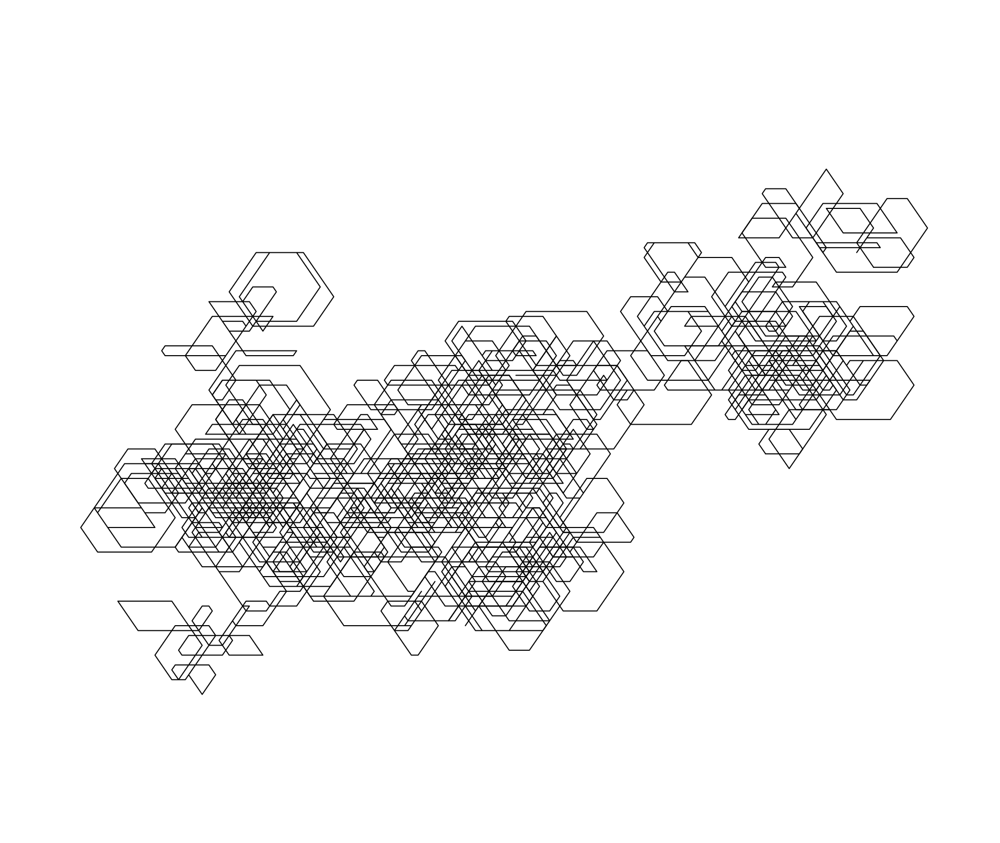
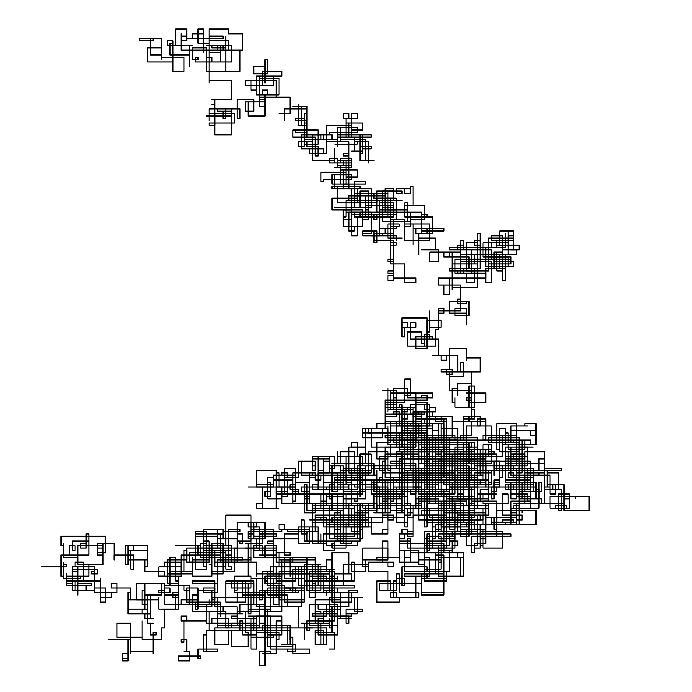
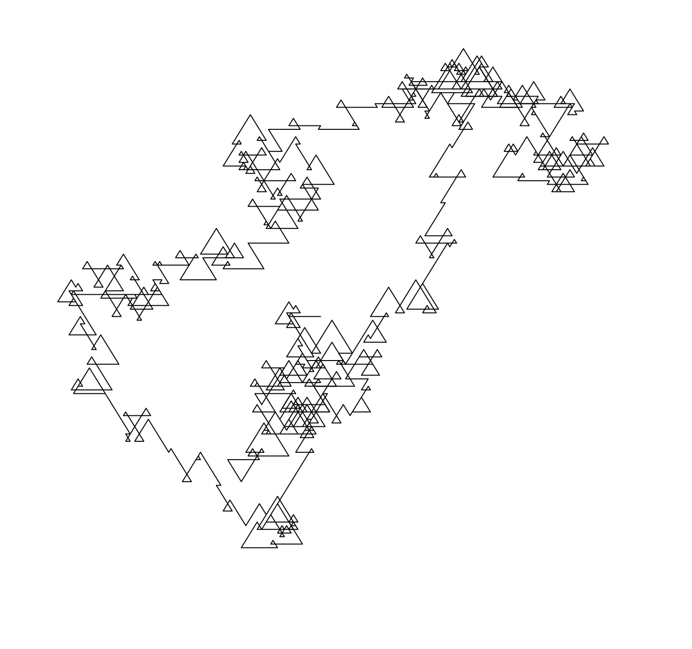

# pdraw.py: Generate Deterministic, Procedural Artwork from Arbitrary Text

pdraw allows users to generate line art from arbitrary text. It has *no dependencies* other than the Python standard library, and works with Python 3.10+ (3.7+ should work but are untested).


Thanks to [Numberphile][1] for the idea for this script.

## Installation

Either copy the `pdraw.py` file or git clone the repository.

```
$ git clone git@github.com:Sonictherocketman/pdraw.git
```

Then simply run the script.

```
$ python3 pdraw.py --help
```

**IMPORTANT NOTICE:** I have not confirmed this, but it looks like versions of Python installed via Homebrew are not suitable for this script as they do not come with the necessary `tkinter` libraries bundled in. I had to install Python direct from [python.org](https://www.python.org/downloads/release/python-3100/)


## Usage Notes


### Encoding Text as Base 10 Numbers

pdraw natively supports drawing strings of base 10 digits. However, pdraw can also sketch arbitrary text. To enable the drawing of arbitrary text, add the `--encode` flag to your command. This will instruct pdraw to first convert each character into its base 10 form (using a silly conversion that could probably be a lot more efficient).


### Faster Drawing

pdraw is meant to be interactive, and so it renders its output fairly frequently. To speed up the drawing process, add the `-r/--refresh-rate` flag with a larger cycle count.


### Changing Draw Distance & Angles

pdraw can also draw with arbitrary draw distances and angles to suit your needs. The `-d/--distance` flag allows you to set a distance multiplier for each line, and the `-a/--angle` flag allows you to set the rotation angle between each line. The default is `90` which draws squares. Use `-a 60` for hexagons, `-a 120` for triangles, and `-a 160` for cool sharp ridges.


### Saving Drawings

pdraw can save drawings as `.eps` files (which can be opened in Preview.app for macOS as well as other PDF viewers). Those files can then be converted to PNG/JPG/etc. Simply supply the `-o/--output` flag with a path to the desired file.

Optionally, you can close pdraw when your drawing is complete and saved by supplying the `-c/--close` flag.


## Example Usage

Below are some quick recipes to get you started.

### Drawing Digits of Pi (in hexagons)

You can download the first [billion digits of Pi here](https://stuff.mit.edu/afs/sipb/contrib/pi/) and start plotting them. Make sure to give pdraw an iteration count though, otherwise it will attempt to draw the entirety of those billion digits, which would probably not work and take forever.

```
$ ./pdraw -i digits-of-pi.txt

```



Note: pdraw also accepts an `--offset` parameter that tells pdraw how many bytes into the file to start reading. Use this to plot various sections of Pi (or other longer files)!


### Drawing pdraw Itself!

Yup. pdraw can of course draw itself. Code is just text after all.

```
$ ./pdraw -i pdraw.py --encode
```




### Visualizing Song Lyrics

One thing I've been having fun with is graphing arbitrary song lyrics. I even printed some for family members of their favorite songs.

```
$ ./pdraw -i peaceful-easy-feeling.txt --encode -a 120
```




### Visualizing Randomness

pdraw can draw any digital data, and it can read from stdout! It cannot however deal with binary data, so you'll need to convert your random bytes into a string. Thankfully, we can do that easily on the command-line.

```
$ cat /dev/urandom | base64 | ./pdraw -n 5000 --encode
```

Note: Make sure to give pdraw an iteration count or it will draw forever!


## About this Script

This script is based on a [Numberphile Video][1] about using procedural techniques to sketch the digits of Pi. Originally, I aimed to simply reproduce their work and play with the artwork I could generate from it. Eventually, that evolved into building a fully-fledged command-line application that could graph arbitrary digits, and since all data on a computer can be converted to numbers, I had effectively built a way to draw anything!

Thanks to Numberphile for putting out amazing videos and for inspiring me to write this script.


## License

This script is available under the terms of the MIT License. See `license.txt` for more information.

Copyright © 2022 Brian Schrader

[1]: https://www.youtube.com/watch?v=tkC1HHuuk7c
